# 一、系统工程与信息系统基础

## 1. 系统工程

### （1）概念

​	从整体出发、从系统观念出发，以求整体最优

### （2）方法

#### ① 霍尔三维结构

+ 逻辑维

+ 时间维

+ 知识维

#### 	② 切克兰德方法

- 认识问题
- 根底定义
- 建立概念模型
- 比较及探寻
- 选择
- 设计与实施
- 评估与反馈

#### ③ 并行工程方法

​	通过让多个开发过程并行进行来加速产品从概念到市场的整个过程

- 产品设计开发期间，最快速度按质完成
- 各项工作问题协调解决
- 适当的信息系统工具

#### ④ 综合集成方法

​	涉及到如何将不同的系统元素、子系统和过程整合到一个统一的框架中，以解决大规模、多方面和高度复杂的问题

- 整体论原则
- 相互联系原则
- 有序性原则
- 动态原则

#### ⑤ WSR系统方法

​	WSR代表“物”、“事”、“人”，这三个字分别触及了系统方法应用中需要考虑的三个关键维度：技术层面（物理）、管理层面（事理）和人文层面（人理）

- 懂物理
- 明事理
- 通人理

### （3）生命周期阶段及方法

- 探索性研究
- 概念阶段
- 开发阶段
- 生产阶段
- 使用阶段
- 保障阶段
- 退役阶段

## 2. 信息系统基础

### （1）生命周期

#### ①生产阶段

#### ②开发阶段

- 总体规划系统分析
- 系统设计
- 系统实施
- 系统验收

#### ③运行阶段

#### ④消亡阶段

### （2）建设原则

#### ①高层管理人员介入原则

#### ②用户参与开发原则

#### ③自顶向下规划原则

#### ④工程化原则

### （3）开发方法

#### ①结构化方法

​	自顶向下

#### ②面向对象方法

​	自底向上，符合人们的思维习惯

#### ③面向服务的方法

​	粗粒度、松耦合，标准化和构件化

#### ④原型法（在前三个方法中的需求阶段会用到）

#### ⑤其他方法

- 形式化方法
- 统一过程方法【up】
- 敏捷方法
- 基于架构的开发方法【ABSD】

### （4）分类

#### ①业务处理系统【TPS】

#### ②管理信息系统【MIS】

#### ③决策支持系统【DSS】

#### ④专家系统【ES】

#### ⑤办公自动化系统【OA】

#### ⑥企业资源计划【ERP】

### （5）案例题

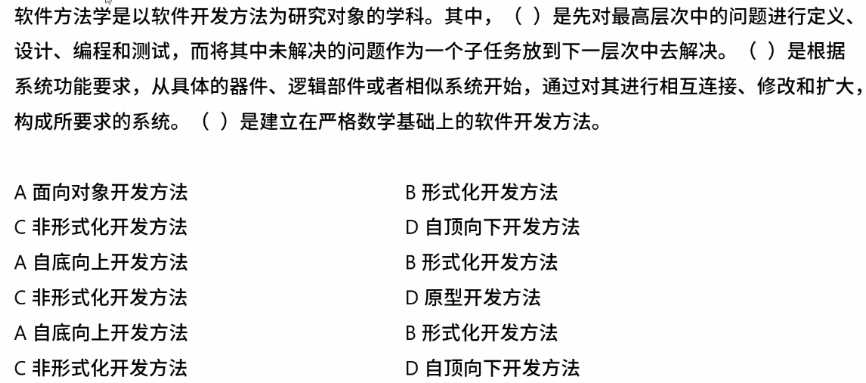

答案：D A B

## 3. 企业信息化

### （1）目的

​	提高企业的竞争力

### （2）信息化需求

#### ①战略需求

​	提升组织的竞争能力

#### ②运作需求

​	实现信息化战略目标、运作策略、人才培养的需要

#### ③技术需求

​	信息技术层面上对系统的完善、升级、集成

#### ④案例

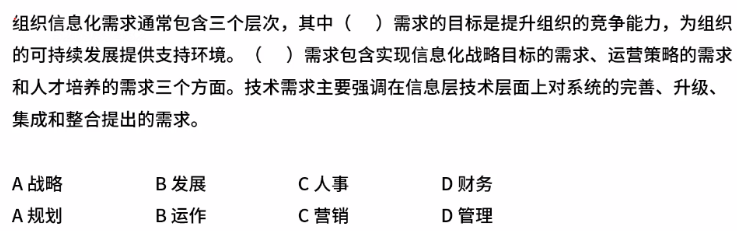

### （3）企业信息化方法

#### ①业务流程重构方法

​	彻底的、根本性的重新设计流程

#### ②核心业务应用方法

​	围绕核心业务推动信息化

#### ③信息系统建设方法

​	建设信息系统作为企业信息化的重点和关键

#### ④主题数据库方法

​	建立面向企业核心业务的数据库，消除信息孤岛

#### ⑤资源管理方法

切入点是为了企业资源管理提供强大工具

#### ⑥人力资本投资方法

​	把一部分企业的优秀员工看作是一种资本

### （4）企业信息化体系全览图

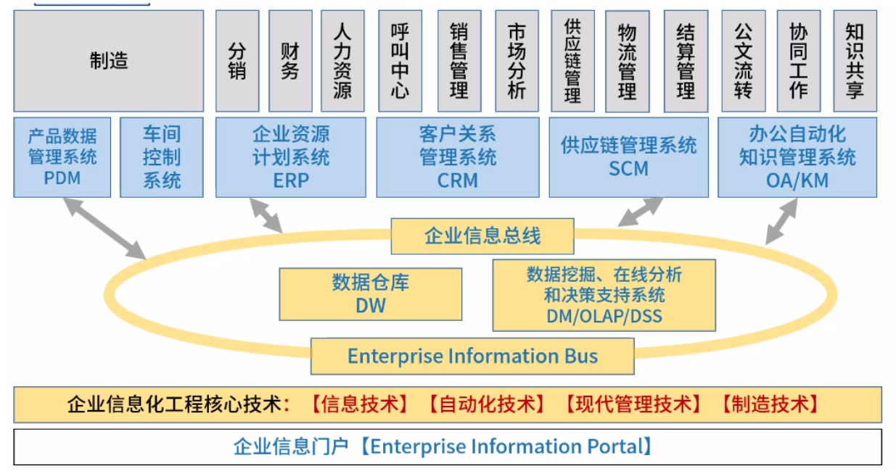

### （5）企业资源计划ERP

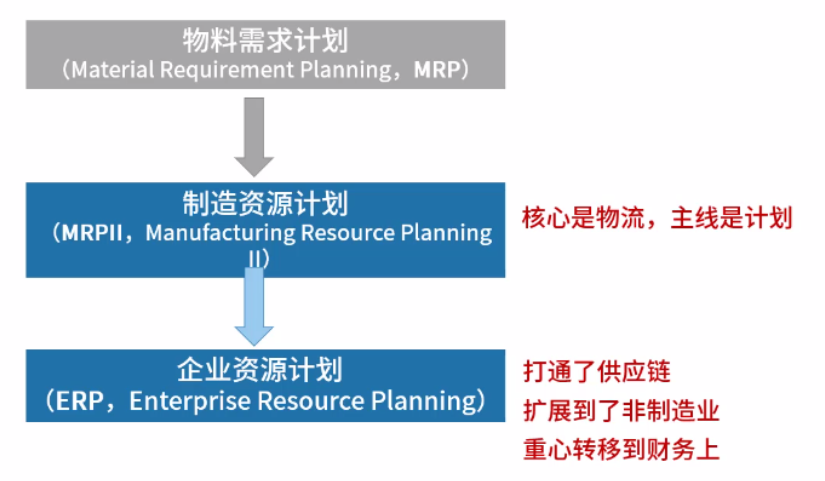

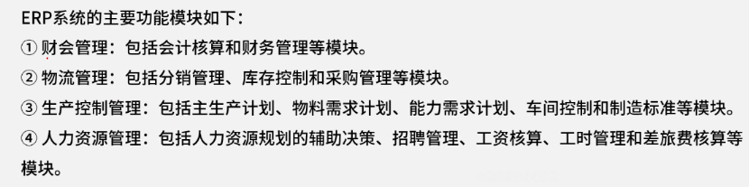

### （6）客户关系管理CRM

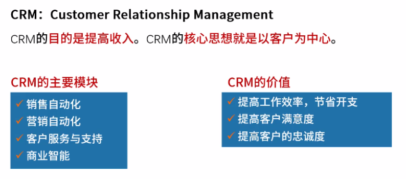

### （7）供应链管理SCM

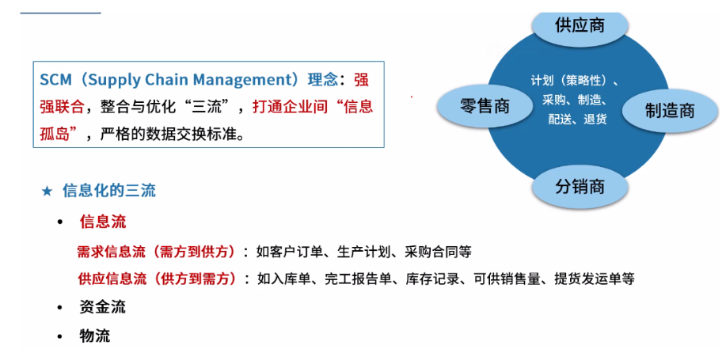

### （8）商业智能BI

#### ①在线分析处理OLAP和在线事务处理OLTP

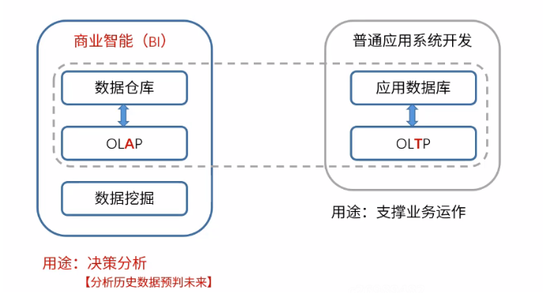

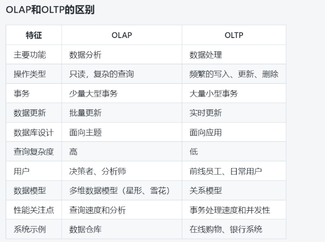

#### ②数据仓库

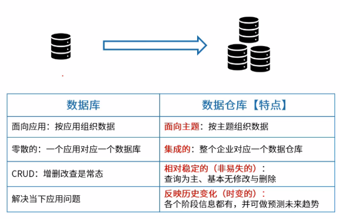

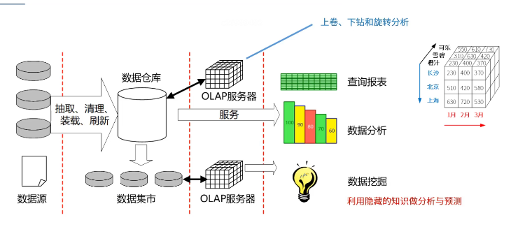

#### ③数据挖掘

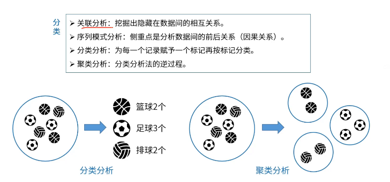

#### ④案例

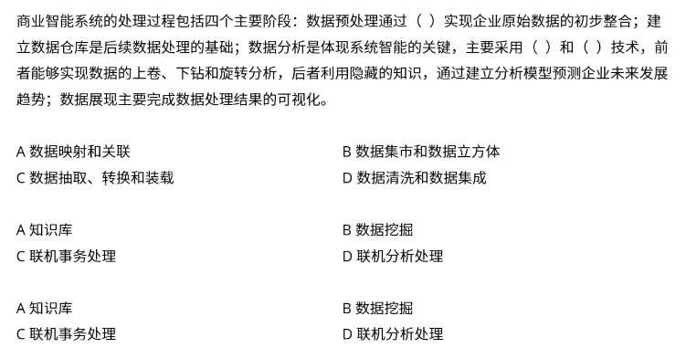

答案：CDB

### （9）数据湖

#### ①概念

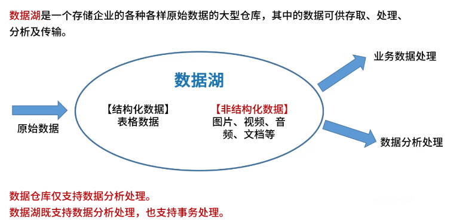

##### ②数据湖和数据仓库的对比

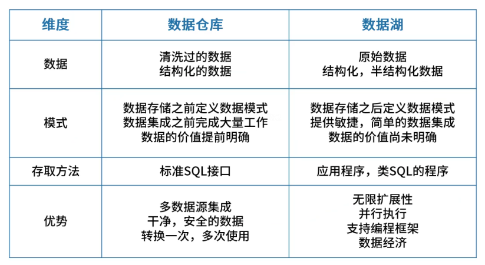

### （10）BPR和BPM

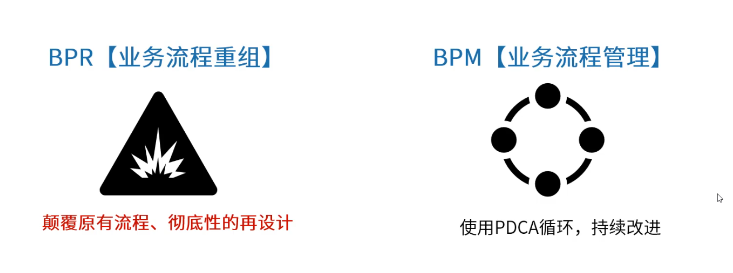

## 4. 信息系统战略规划

## 5. 企业应用集成EAI

## 6. 新技术

